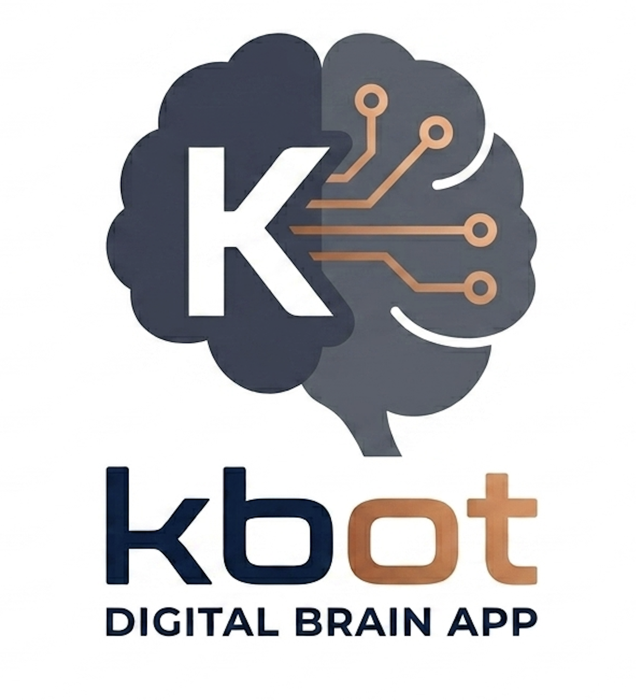

<p align="center">
  
</p>

<h1 align="center">KBot Mobile</h1>

<p align="center">
  <strong>Offline-first AI companion for Android. 100% on-device LLM, voice transcription, semantic search, and automation — no cloud required.</strong>
</p>

<p align="center">
  <a href="https://github.com/kiranbeethoju/kbot_mobile/raw/refs/heads/main/app/build/outputs/apk/release/app-release.apk">
    
  </a>
  <a href="#-quick-start">
    
  </a>
  <a href="#-contributing">
    
  </a>
</p>

<p align="center">
  
  
  
  
  
  
</p>

---

## What is KBot?

KBot turns your phone into a **private second brain**. Record voice notes, search your memories semantically, chat with a local LLM, and schedule automated intelligence — all without sending your data to a server.

```
Record → Transcribe (whisper.cpp) → Embed (MiniLM ONNX) → Store (Room DB)
                                                          → Search (cosine similarity)
                                                          → Summarize (llama.cpp + Gemma)
                                                          → Automate (WorkManager rules engine)
```

## Features

| Category | Capability | Engine |
|----------|-----------|--------|
| **Voice** | One-tap recording, offline transcription | `whisper.cpp` via JNI |
| **Chat** | On-device LLM with tool use | `llama.cpp` running Gemma 4 E2B Q3_K_M |
| **Search** | Semantic search across all memories | MiniLM ONNX + cosine similarity |
| **Context** | Contacts + SMS imported locally | Room DB, zero network |
| **Automation** | Scheduled summaries, memory resurfacing, keyword tagging, habit reflection | WorkManager + custom rules engine |
| **Cloud Fallback** | Optional NVIDIA NIM API streaming | Nemotron Nano Omni 30B |
| **Tools** | Notifications, alarms, calls, SMS — from LLM | Intent-based, offline-safe |
| **Privacy** | No internet permission required for core features | All models run locally |

## Download

**[Download Latest Release APK](https://github.com/kiranbeethoju/kbot_mobile/raw/refs/heads/main/app/build/outputs/apk/release/app-release.apk)**

> The APK is ~976 MB (includes native `.so` libraries for llama.cpp + whisper.cpp compiled for arm64-v8a and armeabi-v7a). Models are NOT bundled — install them separately with the script below.

## Quick Start

### Prerequisites

- **JDK 17** (JDK 25+ is not supported by Gradle 8.7)
- **Android SDK 35** with Build Tools
- **Android Studio Ladybug** or newer (optional)
- A sibling checkout of [llama.cpp](https://github.com/ggml-org/llama.cpp) at `../llama.cpp`

### Build

```bash
# Clone with llama.cpp dependency
git clone https://github.com/kiranbeethoju/kbot_mobile.git
cd kbot_mobile
git clone https://github.com/ggml-org/llama.cpp ../llama.cpp

# Set JDK 17 and build
export JAVA_HOME=/opt/homebrew/Cellar/openjdk@17/17.0.19/libexec/openjdk.jdk/Contents/Home
./gradlew assembleDebug
```

### Install

```bash
# Install the APK
adb install -r app/build/outputs/apk/debug/app-debug.apk

# Push AI models to device
chmod +x scripts/install-models-to-device.sh
./scripts/install-models-to-device.sh
```

### Models Required

| Model | Path on Device | Purpose |
|-------|---------------|---------|
| `ggml-base.en.bin` | `files/models/whisper/` | Speech-to-text |
| `model.onnx` + `vocab.txt` + `tokenizer.json` | `files/models/embeddings/minilm/` | Semantic search |
| `gemma-4-E2B-it-Q3_K_M.gguf` | `files/models/llm/` | Local LLM chat (optional) |

## Architecture

```
app/src/main/java/com/offlinebot/
├── ai/
│   ├── llm/LlamaCppEngine.kt        # llama.cpp JNI bridge — load/warmup/chat/unload lifecycle
│   ├── whisper/WhisperCppEngine.kt  # whisper.cpp JNI — WAV → transcript
│   ├── embeddings/                   # MiniLM ONNX — text → 384-dim vector
│   ├── automation/                   # RuleSchedulerWorker, DailySummaryWorker, ResurfaceWorker
│   ├── cloud/                        # NvidiaApiClient (SSE streaming), ToolExecutor (6 tools)
│   └── download/                     # Model download manager
├── data/database/
│   ├── OfflineBotDatabase.kt         # Room DB v7 — 11 entities
│   └── dao/                          # RecordingDao, EmbeddingDao, AutomationDao, etc.
├── recorder/
│   ├── service/RecordingService.kt   # Foreground audio recording
│   └── storage/AudioStorage.kt       # WAV files in app-private storage
├── ui/
│   ├── home/                         # Main recording + search screen
│   ├── chat/                         # LLM chat with streaming + tool approval
│   ├── automation/                   # Rules editor with time picker + scheduler heartbeat
│   ├── timeline/                     # Chronological memory browser
│   ├── buckets/                      # Weekly bucket organizer
│   ├── search/                       # Full-text + semantic search
│   ├── models/                       # Model download + status
│   ├── settings/                     # System prompt editor, contacts import
│   └── status/                       # Battery, RAM, model metrics
└── utils/
    ├── PerformanceManager.kt         # Eco / Balanced / Performance modes
    ├── ActivityLogger.kt             # Structured event logging
    └── LocationHelper.kt             # GPS metadata for recordings
```

### Key Design Decisions

**One-model-at-a-time pipeline.** Phones have 4–6 GB RAM. The pipeline enforces sequential loading: load Whisper → transcribe → unload → load embeddings → embed → unload → defer LLM. Each engine is a `@Singleton` with explicit `load()`/`unload()` guarded by a `Mutex`.

**5-minute auto-unload.** The LLM frees itself after 5 minutes of inactivity (`LlamaCppEngine.kt:194-210`). A coroutine timer checks the last inference timestamp and calls `nativeFree()`.

**Batched JNI decoding.** `llama-jni.cpp` uses `common_batch_add` + `llama_decode` in batched loops. Thread count is capped at `max(2, min(4, n-2))` — leaving 2 cores free for the UI thread.

**Battery-aware automation.** `shouldSkip()` checks battery level before every scheduled job. If <20% and not charging, the worker returns `Result.success()` without running. The RuleSchedulerWorker polls every 5 minutes (configurable 1m–1h) for pending time-based rules.

**Hybrid search without a vector DB.** Query → ONNX embedding → cosine similarity against all stored vectors → keyword SQL fallback → full-text scan. Deduplication via `LinkedHashSet<Long>`.

**Tool execution with JSON extraction.** The LLM outputs JSON tool calls. The parser strips markdown fences, walks backward from the tool name to find `{`, then counts brace depth for the matching `}`. More robust than regex on nested JSON.

**Cloud as optional upgrade.** Streaming via raw `HttpURLConnection` reading SSE `data:` lines. Each content delta emitted to a Kotlin `Flow<String>` with a 30ms inter-token delay for visible typing effect.

## Contributing

We welcome contributions! Please follow these guidelines:

### Code of Conduct

- Be respectful and constructive in code reviews and discussions
- Assume good intent — this is a passion project built in the open
- Help us keep the codebase clean: no commented-out code, no stale TODOs without linked issues

### How to Contribute

1. **Fork** the repository
2. **Create a branch** from `main`: `git checkout -b feat/your-feature-name`
3. **Make your changes** — follow the existing code style (no wildcard imports, single-expression functions where readable, no unnecessary comments)
4. **Test your changes** — build both debug and release APKs, test on a real device or emulator
5. **Commit** with a clear message: `feat: add X` / `fix: resolve Y` / `refactor: simplify Z`
6. **Push** and open a Pull Request against `main`

### Pull Request Guidelines

- **Keep PRs focused.** One feature or fix per PR. If your change touches more than 5 files, explain why in the description.
- **No breakage.** PRs must compile (`./gradlew assembleDebug` passes) and not regress existing functionality.
- **Describe what and why.** The diff shows *what* changed — your description should explain *why* this is the right approach.
- **Screenshots for UI changes.** Attach before/after screenshots.
- **Tests are welcome but not mandatory.** When in doubt, test on a real device.

### Issue Guidelines

- **Search existing issues first.** Someone may have already reported or fixed it.
- **Use clear titles.** "Automation scheduler doesn't fire on Samsung S23" > "It's broken".
- **Include:** device model, Android version, steps to reproduce, expected vs actual behavior.
- **Feature requests:** explain the use case and why the current workaround doesn't cut it.

### Development Setup

```bash
git clone https://github.com/kiranbeethoju/kbot_mobile.git
cd kbot_mobile
git clone https://github.com/ggml-org/llama.cpp ../llama.cpp
git clone https://github.com/ggml-org/whisper.cpp ../whisper.cpp
export JAVA_HOME=/opt/homebrew/Cellar/openjdk@17/17.0.19/libexec/openjdk.jdk/Contents/Home
./gradlew assembleDebug
```

### Project Structure Conventions

- New screens go in `app/src/main/java/com/offlinebot/ui/<screen>/` with a `Screen.kt` + `ViewModel.kt` pair
- Database entities go in `app/src/main/java/com/offlinebot/data/database/entities/`
- DAOs go in `app/src/main/java/com/offlinebot/data/database/dao/`
- AI engines go in `app/src/main/java/com/offlinebot/ai/<engine>/`
- Native C++ code goes in `app/src/main/cpp/`
- Scripts go in `scripts/`

### First-Time Contributors

Look for issues labeled `good first issue` in the issue tracker. These are small, self-contained tasks to get familiar with the codebase. When in doubt, open a **Draft PR** early — we'll help you shape it.

## Contact

**Maintainer:** Kiran Beethoju — [kiranbeethoju@gmail.com](mailto:kiranbeethoju@gmail.com)

- **Bug reports & feature requests:** [GitHub Issues](https://github.com/kiranbeethoju/kbot_mobile/issues)
- **Discussions:** [GitHub Discussions](https://github.com/kiranbeethoju/kbot_mobile/discussions)

## License

MIT License — see [LICENSE](LICENSE) for details. This project bundles llama.cpp and whisper.cpp (also MIT licensed).

---

<p align="center">
  <strong>Built with ❤️ using Kotlin, Jetpack Compose, llama.cpp, whisper.cpp, and ONNX Runtime.</strong>
</p>
